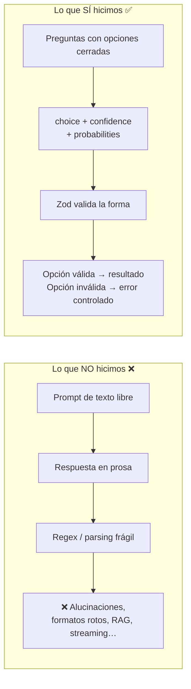
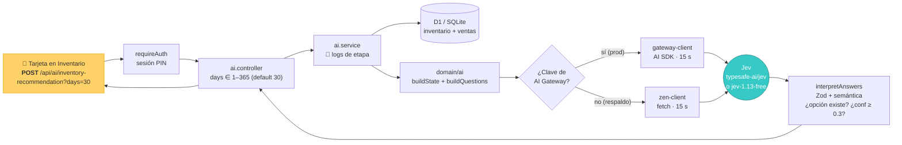
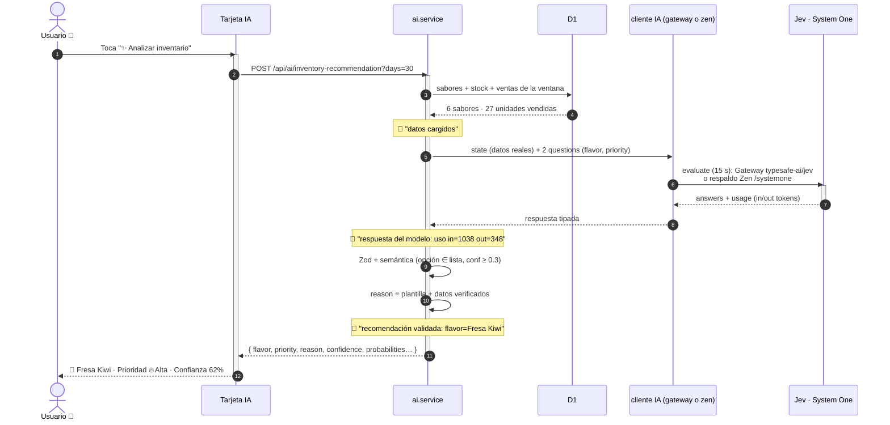
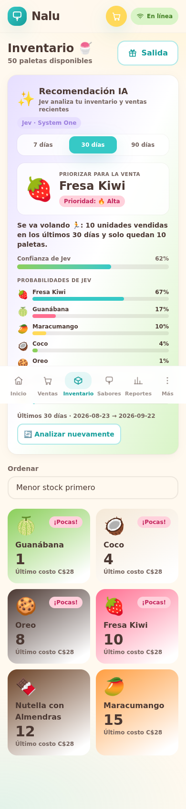
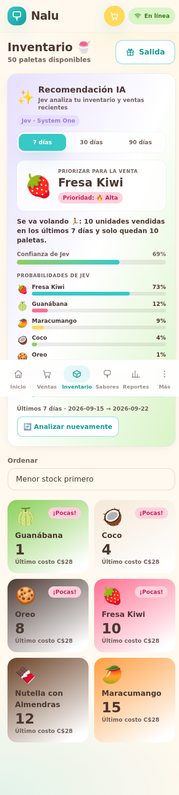
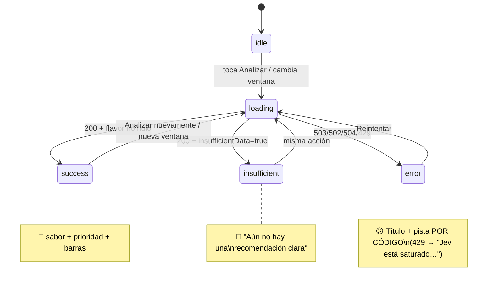
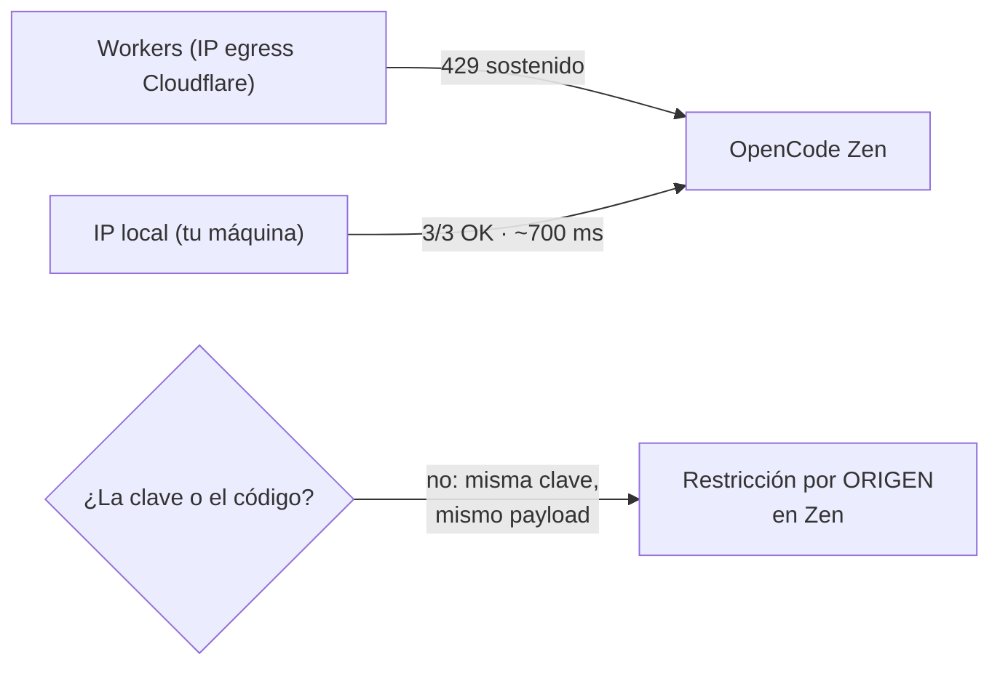

# 🤖 Jev en Nalu — Guía de aprendizaje

> **Qué es esto:** apuntes para entender, de un vistazo, cómo Jev (System One) quedó integrado en Nalu — hoy vía **Vercel AI Gateway**, antes directo vía OpenCode Zen (ver §12) —, **qué aprendimos** construyéndolo y **cómo leerlo** cuando se mire la demo. Con diagramas y capturas reales.

---

## 1. Jev no es un chatbot 💡

Jev — el modelo `jev-1.13-free` de **System One**, accesible vía OpenCode Zen — no responde texto libre que haya que "parsear". Usa **primitivas tipadas de decisión** (*Choice*): tú le envías **preguntas con opciones cerradas** y él devuelve, para cada pregunta:

```jsonc
{
  "type": "choice",
  "choice": "<id de una de las opciones que TÚ enviaste>",
  "confidence": 0.62,          // cuán seguro está de SU elección
  "probabilities": {           // reparto completo entre TODAS las opciones
    "<sabor-1>": 0.67,
    "<sabor-2>": 0.17,
    "ninguno": 0.00,
    "...": 0.16
  }
}
```

Esa es **toda la magia**: no hay parsing frágil, no hay alucinaciones de texto que rechazar, no hay *jailbreak* posible. O la opción existe en tu lista, o la respuesta es inválida → error controlado.



**Regla de oro aplicada:** *el modelo solo decide; Nalu calcula.* Todo lo numérico (stock, ventas, `reason`) lo compone el servidor con datos verificados — el modelo nunca inventa cifras.

---

## 2. El flujo completo, end-to-end



**Arquitectura limpia:** `Route → Controller → Service → Repository` (patrón obligatorio del proyecto). El dominio (`domain/ai/recommendation.ts`) es **puro**: arma el estado, las preguntas e interpreta la respuesta — se testea solo, sin red ni base de datos.

---

## 3. Secuencia de una petición real



---

## 4. Las dos preguntas que se le hacen

| Pregunta | Opciones | Sirve para… |
|---|---|---|
| `flavor` | cada `flavor.id` real + `ninguno` | Elegir **qué sabor priorizar** |
| `priority` | `high` / `medium` / `low` | Elegir **qué tan urgente** es |

Y el **estado** que le llega (solo datos reales, sin rodeos):

```
Nalu es una app de venta de paletas artesanales.
Datos reales por sabor, ventana de últimos 30 días [disponible ahora, vendidas en la ventana]:
- Coco: 5 disponibles, 5 vendidas
- Oreo: 9 disponibles, 1 vendidas
- Fresa Kiwi: 10 disponibles, 10 vendidas
- Nutella con Almendras: 12 disponibles, 3 vendidas
- Maracumango: 15 disponibles, 5 vendidas
- Guanábana: 2 disponibles, 3 vendidas
Usa SOLO estos datos: no inventes ventas, inventario ni sabores.
```

Jev debe considerar **rotación y stock juntos** (no solo "lo que más se vende"): por eso en la semilla real Fresa Kiwi gana (10 vendidas + stock justo) pero Guanábana queda segunda (stock peligroso: 2).

---

## 5. Cómo leer la respuesta 📊

Respuesta **real** (capturada en el smoke test, `days=30`):

```json
{
  "success": true,
  "data": {
    "flavor": { "id": "20000000-…-0003", "name": "Fresa Kiwi", "emoji": "🍓" },
    "priority": "high",
    "reason": "Se va volando 🏃: 10 unidades vendidas en los últimos 30 días y solo quedan 10 paletas.",
    "confidence": 0.61,
    "probabilities": [
      { "name": "Fresa Kiwi",          "p": 0.67 },
      { "name": "Guanábana",           "p": 0.19 },
      { "name": "Maracumango",         "p": 0.07 },
      { "name": "Coco",                "p": 0.05 },
      { "name": "Oreo",                "p": 0.01 },
      { "name": "Nutella con Almendras","p": 0.01 },
      { "name": "Sin recomendación",   "p": 0.00 }
    ],
    "insufficientData": false,
    "range": { "from": "2026-08-23", "to": "2026-09-22", "days": 30 },
    "model": "jev-1.13-free"
  }
}
```

### Las dos escalas que importan

| Concepto | Significado | Ejemplo |
|---|---|---|
| **`confidence`** | Cuánto confía Jev en **su elección** (un solo número) | 0.61 → "62% seguro de Fresa Kiwi" |
| **`probabilities`** | Cómo reparte su apuesta **entre todos los sabores** | 67% Fresa Kiwi, 19% Guanábana… |

Visualizado como lo muestra la tarjeta (30 días):

```
Confianza de Jev  ██████████████████████▌               62%

Probabilidades
Fresa Kiwi        ████████████████████████████▎         67%
Guanábana         ████████                              17%
Maracumango       █████                                 10%
Coco              ██                                     4%
Oreo              ▏                                      1%
Nutella           ▏                                      1%
Sin recomendación                                        0%
```

Y **cambiando la ventana a 7 días** (misma BD, mismo botón):

```
Confianza de Jev  ██████████████████████████▊           69%   (↑ de 62%)

Probabilidades
Fresa Kiwi        ██████████████████████████████▎       73%   (↑ de 67%)
Guanábana         ██████                                12%   (↓ de 17%)
…
```

> 🎮 **Esto es lo jugable:** cambiar 7/30/90 días re-analiza al instante y ves **cómo Jev repondera** rotación vs stock. En 7 días la venta reciente pesa más: Fresa Kiwi sube y la "lenta" Guanábana baja.

**Capturas reales de la demo (móvil):**

| 30 días | 7 días |
|---|---|
|  |  |

---

## 6. Estados de la tarjeta (y sus contrapartes en la API)



| Situación | HTTP | Comportamiento |
|---|---|---|
| Sin ninguna clave de IA | 503 `AI_NOT_CONFIGURED` | La app sigue: aviso amigable |
| Proveedor caído / red | 502 `AI_UNAVAILABLE` | Reintentar disponible |
| Sin respuesta en 15 s | 504 `AI_TIMEOUT` | `AbortSignal` en el cliente |
| Rate limit del proveedor | 429 `AI_RATE_LIMIT` | «Jev está saturado 💤»: esperar un minuto y reintentar |
| Respuesta con forma rara u opción fuera de lista | 502 `AI_INVALID_RESPONSE` | Zod + validación semántica |
| Sin ventas en la ventana o Jev elige `ninguno` o conf < 0.3 | **200** | **No es error**: `insufficientData: true` + mensaje amigable |
| Inventario vacío (0 sabores) | **200** | Se salta el modelo (costo 0) |

**Nunca** se expone un stack trace ni un mensaje en inglés al usuario; los errores de negocio llevan contrato `{ success: false, error: { code, message } }`.

La tarjeta traduce **cada código** a su propia copia (título + pista + detalle del servidor entre comillas) — jamás queda un estado vacío.

**El toggle 👁️/🙈:** el usuario puede ocultar la tarjeta desde su encabezado. El cuerpo colapsa con una transición suave (`grid-rows` 1fr ↔ 0fr + opacidad, respetando `prefers-reduced-motion`), el contenido oculto queda `inert` (fuera del árbol de accesibilidad y del orden de tabulación) y la preferencia persiste en `localStorage` (`nalu.jev.recomendacion-visible`). Así Nalu sigue 100% operable aunque Jev falle.

---

## 7. Lecciones aprendidas (el verdadero "aprendizaje alrededor de Jev") 🧠

1. **Primitivas tipadas > texto libre.** Al elegir *Choice*, la validación pasó de "interpretar prosa" a "verificar un enum". Barato, robusto, testeable.

2. **Cada opción necesita una semántica EXACTA.** La primera versión del prompt decía *"si los datos no alcanzan… elige `ninguno`"*. Resultado: Jev — buen modelo, instrucción vaga — eligió `ninguno` con 0.99 **aunque hubiera ventas**. Lección: `ninguno` ahora significa literalamente **"cero ventas en la ventana"**, escrito así en las instrucciones. Después de ese cambio, con ventas reales siempre elige un sabor (la demo "prendió").

3. **El error se explica con datos, no con el modelo.** Cuando `ninguno` vuelve con `unitsSold = 0`, el `reason` lo compone el servidor: *"Todavía no hay ventas registradas… ¡Tu primera venta lo desbloquea! 🍧"*. Si hay ventas pero Jev no encuentra claro ganador: *"Jev no encontró un sabor claro…"*. El modelo no tiene que adivinar por qué falló.

4. **Umbral de confianza como red de seguridad.** `MIN_CONFIDENCE = 0.3`: por debajo, la respuesta se trata como "datos insuficientes" en vez de forzar una recomendación débil.

5. **El modelo ve un resumen, no la base de datos.** ~1 000 tokens de entrada ⇒ costo mínimo y **privacidad**: viajan agregados por sabor, no nombres de clientes ni nada sensible. Y no hay RAG, memoria ni herramientas: cada llamada es un mundo independiente y auditable.

6. **Jev no es determinista (y está bien).** En corridas seguidas con los mismos datos: confianza 0.61 vs 0.62, `p(Fresa Kiwi)` 0.67 vs 0.67. Señales **estables pero no idénticas** — por eso la UI muestra el reparto completo, no solo el ganador.

7. **Latencia real:** 0.4–0.9 s en caliente, hasta 1.9 s en la primera llamada (frío). Con eso se diseñó el estado "✨ Analizando inventario…" (botón deshabilitado, `aria-live`) y el descarte de respuestas viejas con `requestId` al cambiar de ventana.

8. **La ventana temporal es el "mando de juego".** Un único query param (`days`) convierte la demo en algo interactivo que enseña cómo piensa Jev: cambia la ventana y cambia su razonamiento, sin tocar nada más.

---

## 8. Datos de las corridas reales 📈

| Escenario | `days` | Latencia | Tokens (in/out) | Resultado |
|---|---|---|---|---|
| BD local, ventas viejas | 30 | 748 ms | 1008 / 314 | `ninguno` 0.99 → *"no hay ventas en la ventana"* ✅ correcto |
| BD demo fresca (smoke) | 30 | 708 ms | 1038 / 348 | **Fresa Kiwi**, alta, conf 0.61 |
| BD demo fresca (smoke) | 7 | 453 ms | 1031 / 348 | **Fresa Kiwi**, alta, conf 0.59 |
| BD demo fresca (UI navegador) | 30 | — | — | Fresa Kiwi, conf 62% |
| BD demo fresca (UI navegador) | 7 | — | — | Fresa Kiwi, conf 69% ↑ |

*Interesante:* el caso "ventas viejas" no es un bug — Jev respondió **bien**: cero ventas en la ventana → `ninguno`. La misma semántica que hace brillar la demo también muestra el estado vacío con honestidad.

---

## 9. Seguridad y configuración 🔐

| Pieza | Dónde vive | Nota |
|---|---|---|
| `AI_GATEWAY_API_KEY` | **Secreto de Workers** (prod) / `backend/.env` (local, gitignored) | Clave del Vercel AI Gateway (vck_…) — **preferida**; **nunca** en el repo, logs ni frontend |
| `AI_GATEWAY_MODEL` | `wrangler.jsonc` → `vars` | Alias `typesafe-ai/jev` (no sensible) |
| `OPENCODE_ZEN_API_KEY` | **Secreto de Workers** (respaldo) / `backend/.env` (local) | Respaldo / dev local; **nunca** en el repo, logs ni frontend |
| `ZEN_MODEL` | `wrangler.jsonc` → `vars` | `jev-1.13-free` (no sensible) |
| `ZEN_ENDPOINT` | `wrangler.jsonc` → `vars` | `https://opencode.ai/zen/v1/systemone` |

Los logs de etapa registran flujo y consumo (`uso in=… out=…`), **jamás credenciales**. El frontend solo recibe la recomendación ya validada.

Configurar en prod (una vez):

```bash
cd backend
pnpm exec wrangler secret put AI_GATEWAY_API_KEY      # preferido (prod)
pnpm exec wrangler secret put OPENCODE_ZEN_API_KEY    # respaldo (opcional)
```

---

## 10. Cómo probarlo 🧪

| Nivel | Archivo | Cubre |
|---|---|---|
| Dominio puro | `backend/tests/domain/ai-recommendation.test.ts` | Estado/preguntas/interpretación, `ninguno`, confianza baja, cero ventas |
| Cliente HTTP (Zen) | `backend/tests/ai/zen-client.test.ts` | 401→503, 429, 5xx, timeout/red (con fetch mockeado) |
| Cliente Gateway | `backend/tests/ai/gateway-client.test.ts` | Mapeo de respuesta (confianza/usage) y errores 429/401/400/5xx/timeout/falta de clave (AI SDK mockeado) |
| Selección de proveedor | `backend/tests/ai/client-selection.test.ts` | Precedencia gateway > Zen > ninguno, sin red |
| API | `backend/tests/api/ai-recommendation.test.ts` | Éxito, esquema inválido, proveedor caído, inventario vacío |
| Componente | `frontend/src/features/inventory/AiRecommendationCard.test.tsx` | idle/loading/success/error/insuficiente + selector de ventana + copia por código + toggle ocultar/mostrar |
| E2E | `e2e/tests/ai-recommendation.spec.ts` | La tarjeta en el navegador: siempre un estado definido, sin stack trace + toggle |

Ningún test hace llamadas reales al modelo (cliente inyectable/mock) — la suite es determinista y gratis.

---

## 11. Ideas a futuro 🔭

- **¿Inventario o Dashboard?** La tarjeta vive en *Inventario* porque necesita contexto de stock; pero como **gancho de entrada**, un mini-resumen en el *Dashboard* ("✨ Jev recomienda: Fresa Kiwi") con click-through podría darle más visibilidad. Decisión abierta.
- **Material para blog/LinkedIn:** este mismo documento (sección 2 + 5 + 7) es un buen esqueleto de post: *"Le enseñé a mi app a decidir: integrando un modelo de decisiones tipadas"*. Las dos capturas ya están listas en `docs/assets/`.
- **Más preguntas:** `location` (¿qué ubicación priorizar?) o `price` (¿subir/bajar precio?) son candidatas naturales — el contrato ya las soporta (agregar una question más, sin tocar la UI de un saque).
- **Costo:** ~1.4k tokens por llamada con `jev-1.13-free` ⇒ prácticamente cero en la demo; medir si crece el prompt.

---

## 12. Incidente 429 y migración al Vercel AI Gateway 🌩️

**El problema (producción).** Tras desplegar v1.5.0, la tarjeta fallaba **siempre** en prod con `429 AI_RATE_LIMIT`. El diagnóstico:



1. `wrangler tail` mostraba el pipeline **completo** (15 sabores, 32 vendidas) hasta la llamada al modelo → 429 upstream. Logs, validación y datos: todo bien.
2. La **misma clave + mismo payload** funcionaba **3/3** (~700 ms) desde la IP local.
3. Conclusión: **OpenCode Zen limita/bloquea por origen** — las IPs salientes de Cloudflare Workers quedan rate-limited de forma sostenida. No era la clave ni el código.

**La solución: Vercel AI Gateway.** El backend llama ahora a Jev con el AI SDK (`experimental_evaluate`) contra `ai-gateway.vercel.sh`, usando el alias **`typesafe-ai/jev`** — el mismo modelo, otro origen serverless soportado. La receta es exactamente la que ya usa **Kev** (proyecto hermano) en su `jev-evaluate.mjs`/`jev.py`.

**Precedencia de proveedor** (`ai.service.ts`):

1. `AI_GATEWAY_API_KEY` (vck_…) → **gateway** — producción.
2. `OPENCODE_ZEN_API_KEY` → **Zen** — desarrollo local / respaldo.
3. Ninguna → `503 AI_NOT_CONFIGURED` (la app sigue igual).

El contrato de errores es **idéntico en ambos proveedores** (fábricas compartidas en `services/ai/errors.ts`): la UI distingue 429, timeout, no configurado… sin importar quién responda. La respuesta del gateway se mapea a la forma System One (`answers` + confianza desde `providerMetadata.typesafe.confidence`, con *fallback* a `probabilities[choice]`) y la sigue validando el mismo Zod + semántica de siempre.

**Capa de UX (por si vuelve a fallar).** Como el proveedor puede fallar de nuevo, la tarjeta ganó:

- **Mensajes por código**: 429 → *«Jev está saturado 💤»* + pista de esperar; timeout → *«Jev tardó demasiado 🐢»*; etc. Siempre título + pista + detalle — nunca un estado vacío.
- **Toggle 👁️/🙈** para ocultar la tarjeta: colapsa con transición suave (respetando `prefers-reduced-motion`), contenido oculto `inert`, preferencia en `localStorage`.

---

## 13. Alternativas evaluadas 🧭

| Alternativa | Qué es | Veredicto |
|---|---|---|
| **Vercel AI Gateway** ✅ | Gateway serverless multi-modelo (Vercel) con alias `typesafe-ai/jev` | **Elegido**: receta probada por Kev, cuenta ya existente, mismo Jev, otro origen. Clave `vck_` server-side |
| **kev** | Familia de modelos *self-host* compatible con la API/contrato de Jev | A futuro si queremos independencia total de terceros: requiere GPU (Modal/replica propia). No para hoy |
| **laya** | Modelo *self-host* más ligero, compatible con Jev | Respaldo auto-hospedable interesante; su zero-shot es más débil que Jev en esta tarea |
| **Zen directo** (origen local) | Como en v1.5.0 | Se mantiene como respaldo y desarrollo local; desde IPs de Workers en prod queda bloqueado por origen |

Lección meta: **la restricción no era del modelo, sino del camino**. El contrato tipado de Jev hizo trivial cambiar de transporte — mismas preguntas, mismas respuestas, mismo validador.

---

*Documento vivo — actualízalo cuando Jev cambie. Última actualización: migración al AI Gateway (post-v1.5.0).*
